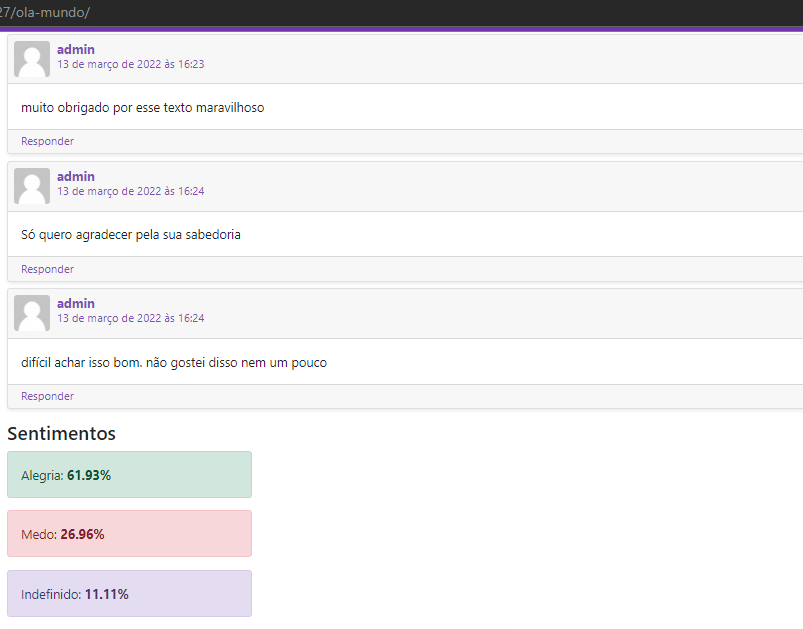

# Plugin de análise de sentimentos
## Instalção
 1 - Copie a pasta do plugin para o caminho wp-content/plugin de sua aplicação Wordpress.
 2 - Acesse os plugins e ative o plugin.
## Modifique a rota de sua API
Acesse o arquivo comments_sent.php e modifique a variável base_url para o endereço de sua API.
## Visualização
Acesse uma página com comentários e visualize o resultado da análise após o último comentário.

